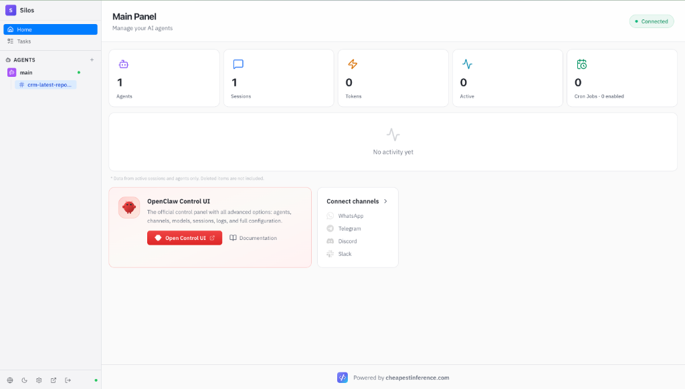
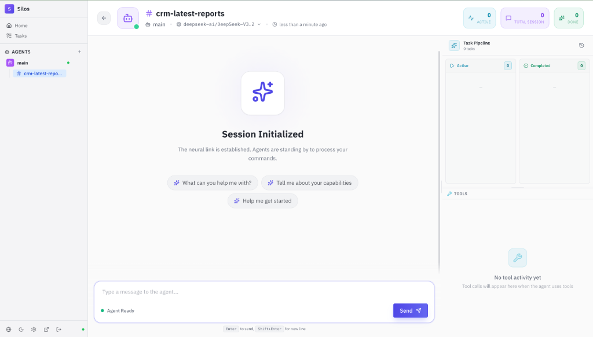
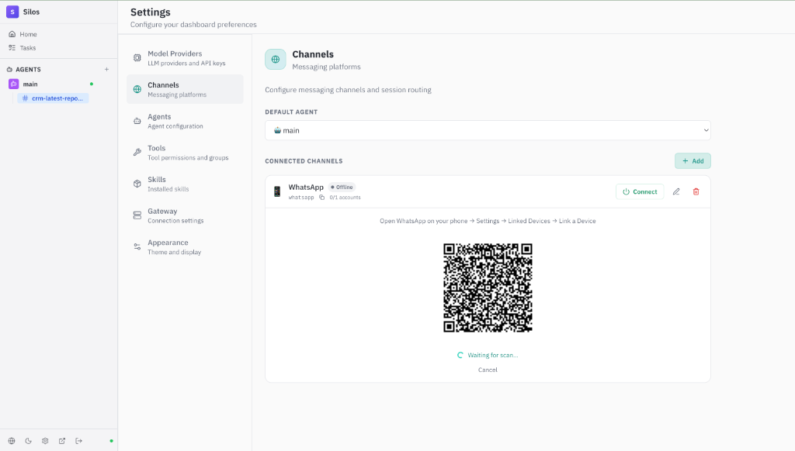
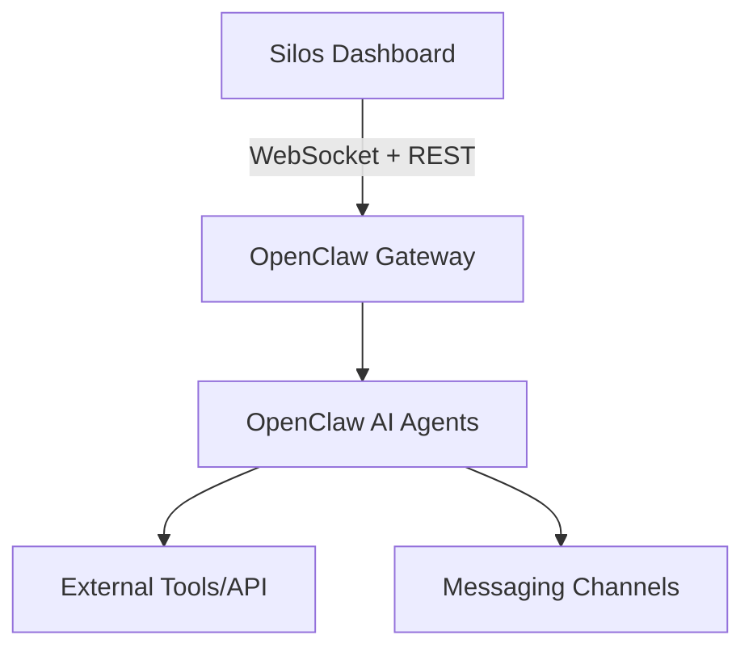

# 🚀 Silos: The Command Center for OpenClaw

**Silos transforms OpenClaw from a powerful framework into a professional AI Operation Center.**

Stop managing your agents through terminals and raw config files. Silos provides a high-performance, intuitive web interface to monitor, configure, and scale your AI agents in real-time.

[](https://github.com/cheapestinference/silos/releases)
[](https://github.com/cheapestinference/silos/pkgs/container/silos)
[](CONTRIBUTING.md)

[](https://silosplatform.com)
[](https://github.com/cheapestinference/silos/blob/main/LICENSE)

---

## 🎬 See it in Action


https://github.com/user-attachments/assets/86835726-f840-40e3-8847-cc33dee63ad4

*The most intuitive way to control your AI agents in real-time.*

---

## ⚡️ Quick Start (Self-Hosted)

Get your dashboard up and running in seconds using Docker:

```bash
docker pull ghcr.io/cheapestinference/silos:latest

docker run -p 3001:3001 \
 -e GATEWAY_TOKEN=your-token \
 -e OWNER_EMAIL=you@example.com \
 ghcr.io/cheapestinference/silos:latest
```
👉 Open `http://localhost:3001` and connect your OpenClaw Gateway.

---

## ☁️ The "Zero Friction" Path
**Don't want to manage VPS, Docker, or Security updates?**

Get a fully managed OpenClaw instance with **Flat-Rate AI included**. No per-token anxiety, no setup headaches. Ready in 5 minutes.

👉 **[Deploy on SilosPlatform.com](https://silosplatform.com)**

---

## 🛠 The Power of Silos

Silos isn't just a UI; it's a complete management layer for the OpenClaw ecosystem.

### 🧠 Total Brain Control


*   **Live Brain Editor:** Edit `SOUL.md`, `IDENTITY.md`, `MEMORY.md`, and `BOOTSTRAP.md` on the fly.
*   **Workspace Explorer:** Full CRUD access to your agent's files and folders.
*   **Dynamic Model Selection:** Swap between GPT, Claude, DeepSeek, or Mistral per agent.
*   **Tool Permissions:** Granular control over which tools each agent can access.

### 📈 Operational Intelligence


*   **Real-time Session Monitoring:** Track token usage, context window utilization, and active agents.
*   **Task Pipeline (Kanban):** Visualize running, completed, and failed tasks. Stop or abort any process instantly.
*   **Advanced Scheduling:** Create one-time, interval, or complex Cron-expression schedules for your agents.
*   **Subagent Hierarchy:** Full visibility into parent-child session delegation.

### 🌐 Seamless Connectivity


*   **Omnichannel Hub:** One-click pairing for WhatsApp (QR), Telegram, Discord, and Slack.
*   **Skill Marketplace:** Browse, install, and manage skills directly from [ClawHub](https://clawhub.ai/).
*   **Gateway Management:** Centralized control of your OpenClaw Gateway connection and auth.

---

## 📐 Architecture



**Tech Stack:** React 19, TypeScript, Vite, Tailwind CSS, Zustand, Firebase Auth.

---

## 🤝 Contributing
We love contributions! Whether it's a new feature, a bug fix, or a translation, check out our [CONTRIBUTING.md](/CONTRIBUTING.md) to get started.

**Project by [CheapestInference](https://cheapestinference.com)**
